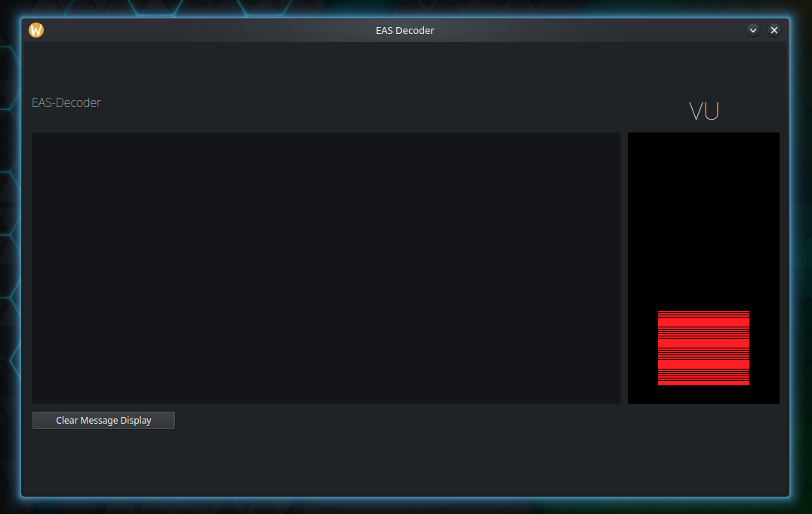

# EAS-Decoder 
### [A program To Decode Emergency Alerts](https://en.wikipedia.org/wiki/Emergency_Alert_System)

The Program Uses multimon-ng to decode the inital Raw [SAME](https://en.wikipedia.org/wiki/Emergency_Alert_System#Technical_concept) header.
The output of the program will be stored in a directory name, "output"
Each new alert will create a directory.

## User interface
The program uses qtpy to make it compatible with pyqt5, pyside2, pyqt6 and pyside6.

***[The program can be used on a raspberry PI with an lcd display and a few buttons and a switch to create a hardware UI or on a normal system.](https://github.com/VariousTurtle/EAS-Decoder?tab=readme-ov-file#rasperry-pi-hardware-documentation)***

There is also an webpage hosted when the program is running, to view it go to the terminal there should be somthing like:

    Serving HTTP on 192.168.0.0 port 8080 (http://192.168.0.0:8080/)
copy the and paste the link in a broweser to view it, you can see all the alerts reccorded and listen to them.

## outputs
Each recorded alert Directory will be named like this

    EAS Origonater-Date-Time-Event Type
Example

    EAS-06-12-25-18-17-36-RWT
Inside of each alert directory there will be a audio recording in the wav flormat and a text document both named

    output.txt
    output.wav
The text document will contain the raw header and the header translated into readable text, Like

    EAS: ZCZC-WXR-SVR-013135-013157-013013-013297+0045-1640042-WJON/TV -
    The National Weather Service has issued a Severe Thunderstorm Warning for Barrow, GA; Gwinnett, GA; Jackson, GA; and Walton, GA; beginning at 07:42 pm and ending at 08:27 pm. Message from WJON/TV.
    NNNN

## Installation
first clone the repo

    git clone https://github.com/VariousTurtle/EAS-Decoder/
    cd EAS-Decoder

make a virtual environment

    # for regular systems
    python -m venv env
    # for raspberry pi
    python -m venv env --system-site-packages

Initalize virtual enviorment

    source env/bin/activate

Install the python requrments

    # for regular systems
    pip install -r reqirments.txt
    # for raspberry Pi
    pip install -r raspi_req.txt

    # only for raspberry pi
    apt install python3-pyqt5
    apt install python3-pyaudio

Then, install multimon-ng, Multimon-ng does the raw decodeing of the SAME Header

    # for arch
    pacman -S multimon-ng
    # for debian or raspberry pi
    apt install multimon-ng

If you are running this on a normal stytem without the raspbery pi hardware run the program with the --Lcd flag
    
    python main.py -l
    # or
    python main.py -lcd

If you are running it with the raspberry pi hardware run it without the --lcd argument

## Arguments
run the program with the --help to see the a available flags

    python main.py --help

### output

    usage: EAS-Decoder [-h] [-i IP] [-l] [-s SPEED]
    
    EAS-Decoder: A program to Record Emergency Alerts (Decodes With Multimon-ng)
    
    options:
      -h, --help         show this help message and exit
      -i, --ip IP        Explcitly define the ip address for the webserver
      -l, --lcd          Run Without LCD screen
      -s, --speed SPEED  Sets the text scroll speed of the LCD screen, Defalut is 0.1

# Rasperry Pi hardware Documentation
***TODO: Add Documentation For Raspberry pi hardware support***

    

